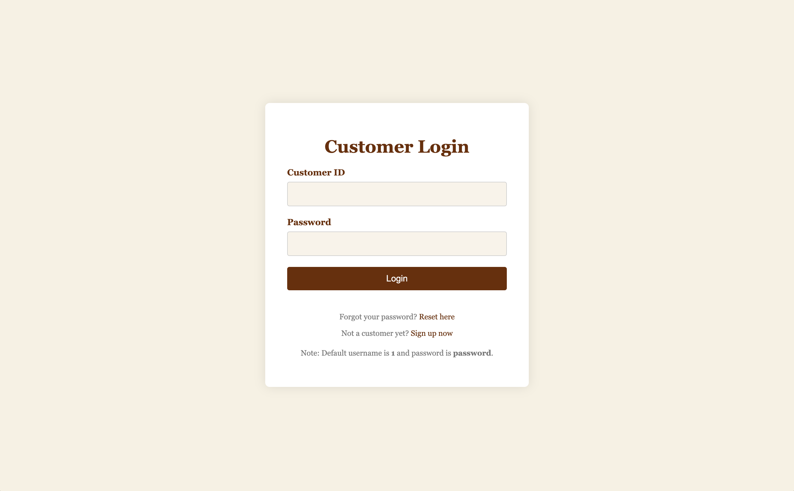
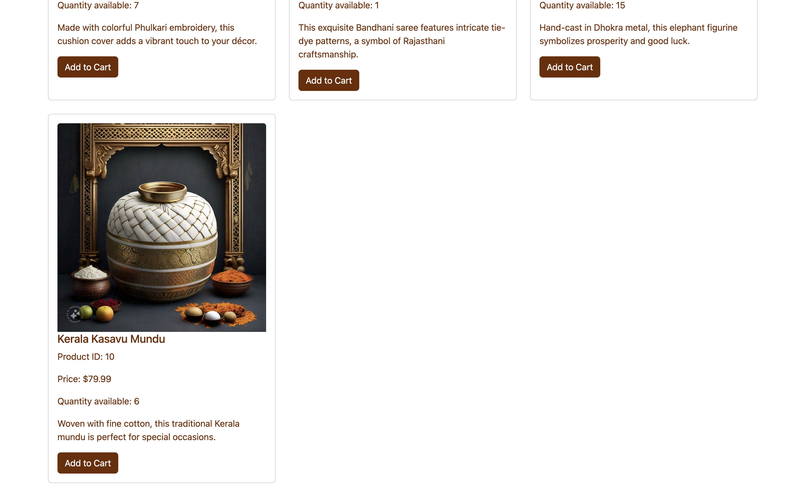
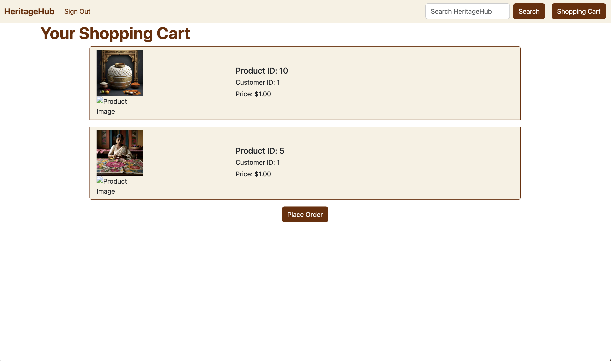
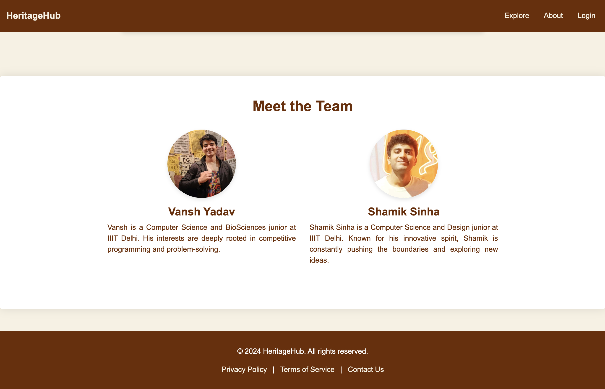
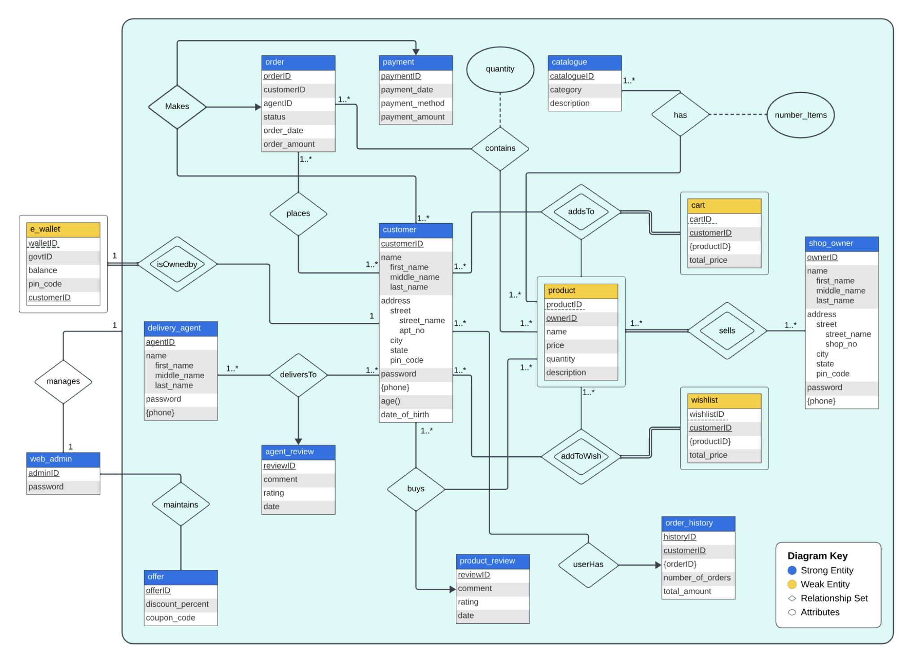
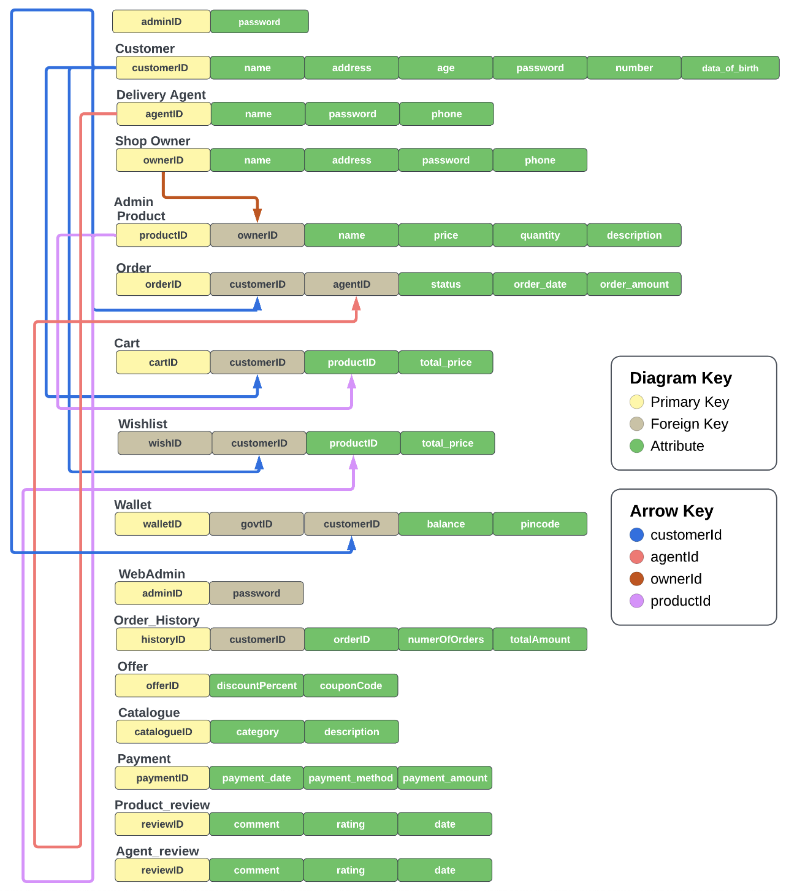

# 🏛️ HeritageHub: Celebrating Our Cultural Legacy 🌍

HeritageHub is dedicated to preserving and promoting the rich cultural heritage of India. We bridge the gap between traditional artisans and a global audience, providing them with tools to thrive in the digital age.

With a passion for cultural preservation, we empower craftsmen to sustain their unique skills and traditions. By bringing India's cultural treasures to the forefront, we celebrate and sustain our diverse heritage for generations to come.

- **Live Demo:** [Check out our site here!](http://heritagehubonline.pythonanywhere.com/)

## Project Overview

HeritageHub is an E-commerce platform utilizing MySQL, Python, and Flask to promote Indian heritage and traditional items, emphasising cultural diversity and user engagement. HeritageHub was developed as a part the course project in Database mangagement Systems course at IIIT Delhi, Winter semester 2023-24.

## Features

- Explore products of cultural and heritage value.
- View images and multimedia content related to each product.
- Order products and add them to your cart.
- User registration and authentication system.
- Admin panel for site management.

## Project Images
|  |  |
|---------------------------------|---------------------------------|
| *Landing page of HeritageHub*   | *Landing page and footer*       |

|  |  |
|---------------------------------|-----------------------------------|
| *Login as Admin or Customer*    | *Customer login interface*        |

|  |  |
|---------------------------------|---------------------------------|
| *Product catalogue*             | *Scrollable interface*          |

|  |  |
|---------------------------------|---------------------------------|
| *Product details given*         | *Adding products to cart*       |

|  |  |
|---------------------------------|---------------------------------|
| *View items in your cart*       | *About page*                    |

## Database Diagrams

    

        <h3>Entity-Relationship Diagram</h3>
        
        
<em>ER Diagram illustrating the database structure.</em>

    

    

        <h3>Relational Diagram</h3>
        
        
<em>Relational Diagram showing database tables and relationships.</em>

    

## Technologies Used

- Python
- Flask
- MySQL
- HTML/CSS
- JavaScript

## Installation

To set up and run HeritageHub locally:

1. Clone the repository from [GitHub](https://github.com/vansh22559/HeritageHub-Flask-MySQLApp).
2. Install dependencies using `pip install -r requirements.txt`.
3. Configure your MySQL database settings in `config.py`.
4. Initialize the database using Flask-Migrate.
5. Run the application with `python app.py`.

## Usage

Once the application is running locally:

- Access the application through your browser at `[http://localhost:5000](http://heritagehubonline.pythonanywhere.com/)`.
- Login with existing credentials, **user 1** and **password** as password.
- Explore cultural heritage products, view details, and interact with the content.
- Admins can log in to manage site data and update information.

## Demo

Visit the live demo [here](http://heritagehubonline.pythonanywhere.com/).

## Contributors

- [Shamik Sinha](https://github.com/theshamiksinha)
- [Vansh Yadav](https://github.com/vansh22559)

## License

This project is licensed under the MIT License - see the [LICENSE](LICENSE) file for details.
